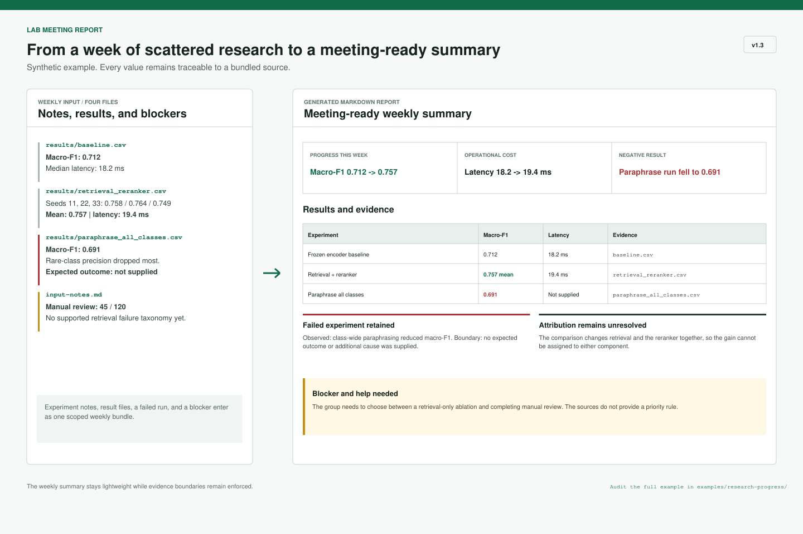

# Lab Meeting Report

[](https://github.com/LikC1606/lab-meeting-report-skill/actions/workflows/validate-skill.yml)
[](https://skills.sh/LikC1606/lab-meeting-report-skill)
[](https://github.com/LikC1606/lab-meeting-report-skill/releases)
[](LICENSE)

Turn a PhD student's weekly experiment notes, paper notes, result files, figures, and work update into a Markdown lab meeting report that is ready to present, archive, and continue next week.

The only required input is the weekly material. The skill extracts progress, key evidence, failed attempts, blockers, and next actions for a research progress report, paper review, or mixed report. Optional adapters can publish the validated report to Feishu/Lark or Notion and prepare Markdown, Marp, Quarto, or editable-PPTX content.



[中文文档](README.zh-CN.md) | [Complete examples](#complete-examples) | [Measured quality](#measured-quality) | [Contributing](CONTRIBUTING.md)

If this saves a lab-meeting preparation cycle, [star the repository](https://github.com/LikC1606/lab-meeting-report-skill) so other researchers can find it.

## 60-Second Synthetic Demo

> This is a synthetic microscopy-segmentation project used to demonstrate the workflow. Every project detail and result is fictional; it is not presented as a real PhD-student or user case study.

The input is a small bundle of raw weekly material rather than a prepared report:

- [weekly notes](examples/weekly-summary/weekly-notes.md) with three completed seeds, a failed branch, an OOM run, and a resource decision;
- [experiment results](examples/weekly-summary/results.csv) with Dice, IoU, GPU memory, and run status;
- [paper notes](examples/weekly-summary/paper-notes.md) about a potentially relevant method that has not been validated on the current data.

The skill turns that bundle into:

- a [meeting-ready Markdown report](examples/weekly-summary/report.md) whose first screen covers progress, evidence, the blocker, and the next action while retaining the failed experiment and avoiding invented significance;
- a [seven-slide Marp deck](examples/weekly-summary/slides.md) covering the result table, negative result, OOM decision, literature boundary, and next-week deliverable.

Reproduce the workflow with this request:

```text
Use $lab-meeting-report to read the weekly notes, results, and paper notes in
examples/weekly-summary, then create a Chinese report and a 10-minute Marp deck.
```

## Start Here

Install from the public GitHub repository:

```bash
npx skills add https://github.com/LikC1606/lab-meeting-report-skill --skill lab-meeting-report
```

For a global, non-interactive installation on macOS or Linux:

```bash
npx skills add LikC1606/lab-meeting-report-skill@lab-meeting-report -g -y
```

On Windows PowerShell, use `npx.cmd`:

```powershell
npx.cmd skills add LikC1606/lab-meeting-report-skill@lab-meeting-report -g -y
```

Then use a natural request:

```text
Use $lab-meeting-report to read ./weekly and the update I pasted above,
then create this week's lab meeting summary in English.
```

The source is the only required field. Pasted text, attachments, directories, papers, results, and figures all count. Mode, language, date, and path can be inferred. The default output is a real file:

```text
reports/group-meeting/YYYY-MM-DD.md
```

## Default Output

The first screen answers four questions:

1. What meaningful progress happened this week?
2. What result, figure, paper finding, or artifact supports it?
3. What is blocked, and what help or discussion is needed?
4. What happens next, with what artifact and success criterion?

The remaining sections are selected from the material and normally cover completed work, key results and figures, relevant paper insights, failed attempts, blockers, next-week actions, and sources. Empty sections are omitted.

Sparse material automatically produces a brief report. Full claim provenance and evidence-completeness tables appear only when `audit` detail is requested or the evidence materially conflicts.

## One Request, Optional Destinations

```text
Use $lab-meeting-report to read this week's experiments, paper notes, and figures.
Create the Markdown report, publish it to Feishu, and prepare a 10-minute Marp deck.
```

```text
Use $lab-meeting-report to summarize ./weekly and publish the result under
this Notion page: <page URL>.
```

Every remote or presentation artifact is derived from the validated local Markdown. A failed export or cloud write never invalidates the local report.

## Report Modes

| Mode | Best for | Core content |
|---|---|---|
| Research progress report | Experiments, implementations, ongoing projects | Weekly work, results, failed attempts, blockers, next actions |
| Paper review / journal club | Paper reading and literature discussion | Question, method, evidence, limitations, relevance to current work |
| Mixed | Connecting current work to literature | Current results, literature mapping, comparison boundaries, validation plan |

Supported inputs include pasted notes, Markdown, text, PDF, CSV, Excel, figures, screenshots, code changes, and explicitly selected Feishu/Lark or Notion resources. Availability depends on the host agent's tools.

## Feishu/Lark And Notion

Local Markdown generation has no cloud dependency. Remote publishing always follows: local generation, quality validation, authorized write, remote fetch verification, and verified-link writeback.

Feishu/Lark uses the official [`lark-cli`](https://github.com/larksuite/cli) and the applicable Lark skills. It reads only explicitly scoped resources, uses user identity, and does not silently overwrite or delete remote content.

Notion uses the official [Notion MCP](https://developers.notion.com/guides/mcp/overview) with OAuth. The adapter can create, update, and verify pages through `notion-create-pages`, `notion-update-page`, and `notion-fetch`. It does not ask users to paste API tokens into chat or scan an entire workspace by default.

## Presentation Adapters

Presentation output is optional and modular:

| Need | Preferred adapter | Boundary |
|---|---|---|
| Talking points | Plain Markdown | No extra tool required |
| Fast HTML, PDF, or simple PPTX | [Marp CLI](https://github.com/marp-team/marp-cli) | Standard PPTX is usually not fully editable |
| Equations, citations, academic formats | [Quarto](https://quarto.org/docs/presentations/) | Supports reveal.js, PPTX, and Beamer |
| Natively editable PowerPoint | [PptxGenJS](https://github.com/gitbrent/PptxGenJS) | Requires an existing tested layout adapter |
| Interactive web deck | [Slidev](https://github.com/slidevjs/slidev) | Used only when explicitly selected or already in the project |

The skill never installs these tools silently. If an adapter is unavailable, it keeps a usable Markdown deck and reports the missing dependency.

## Before And After The Meeting

The source remains the only required input. Stage, audience, duration, and previous actions are optional.

| Stage | Behavior |
|---|---|
| `before` (default) | Create the weekly snapshot, evidence, blockers, and next steps |
| `after` | Preserve the pre-meeting report and append only explicit recorded decisions and actions |
| `both` | Create the pre-meeting report, then add separately attributed post-meeting records |

When a recorded meeting decision resolves a pre-meeting blocker, the report retains it for traceability but labels it as resolved instead of presenting it as current.

## Evidence Safeguards

Lightweight input does not remove research safeguards. The skill continues to:

- avoid inventing results, metrics, citations, authors, venues, DOI values, or causal explanations;
- preserve supplied measurements and units;
- retain failed experiments, negative results, and unresolved conflicts;
- separate facts, interpretations, and hypotheses;
- protect manual content and UTF-8 encoding when updating reports;
- surface only consequential gaps by default and reserve full audit tables for `audit` detail.

Read the complete workflow in [`lab-meeting-report/SKILL.md`](lab-meeting-report/SKILL.md).

## Complete Examples

All example data, paper notes, and results are synthetic. Start with the weekly-summary example to see the concise `standard` workflow and its Marp companion. The other bundled examples use `audit` detail to demonstrate evidence boundaries.

| Workflow | Source material | Generated report |
|---|---|---|
| Default weekly summary | [Weekly notes](examples/weekly-summary/weekly-notes.md), [paper notes](examples/weekly-summary/paper-notes.md), and [results](examples/weekly-summary/results.csv) | [Concise report](examples/weekly-summary/report.md) and [Marp deck](examples/weekly-summary/slides.md) |
| Research progress | [Notes](examples/research-progress/input-notes.md) and [result files](examples/research-progress/results) | [Report](examples/research-progress/report.md) |
| Journal club | [Input notes](examples/journal-club/input-notes.md) and [paper notes](examples/journal-club/papers/synthetic-retrieval-notes.md) | [Report](examples/journal-club/report.md) |
| Progress plus literature | [Combined notes](examples/mixed/input-notes.md), [results](examples/mixed/results/current_experiment.csv), and [paper notes](examples/mixed/papers/synthetic-balanced-retrieval.md) | [Report](examples/mixed/report.md) |

## Measured Quality

The v1.2 evidence safeguards passed the strict gate in 24/24 runs across eight public synthetic research-progress cases; the frozen v1.1 baseline passed 0/24. v1.3 retains those evaluated evidence rules while redesigning the default input, output, and optional adapters. A separate [Chinese mixed weekly-workflow case](evals/weekly-workflow/cases/chinese-mixed-decision) now exercises the default report plus Marp path and checks slide structure, source coverage, negative-result retention, and numeric closed-world behavior. This deterministic gate still does not establish real PhD-student preference or cloud-publishing reliability.

Review the [evaluation design](docs/superpowers/specs/2026-07-13-lab-meeting-report-v1.2-quality-evaluation-design.md), [public cases](evals/research-progress/cases), [versioned benchmark](benchmarks/v1.1-v1.2/benchmark.md), and [claim-level self-audit](benchmarks/v1.1-v1.2/semantic-review-final.json).

## Feedback And Contributions

- Report a reproducible problem with the [bug form](https://github.com/LikC1606/lab-meeting-report-skill/issues/new?template=bug_report.yml).
- Propose a reusable improvement with the [feature form](https://github.com/LikC1606/lab-meeting-report-skill/issues/new?template=feature_request.yml).
- Share a synthetic or anonymized workflow with the [example form](https://github.com/LikC1606/lab-meeting-report-skill/issues/new?template=example_submission.yml).
- Ask questions and compare workflows in [Discussions](https://github.com/LikC1606/lab-meeting-report-skill/discussions).

See [CONTRIBUTING.md](CONTRIBUTING.md) and [SECURITY.md](SECURITY.md).

## 中文说明

完整中文安装、示例、能力边界和贡献说明见 [README.zh-CN.md](README.zh-CN.md)。

## License

[MIT](LICENSE)
